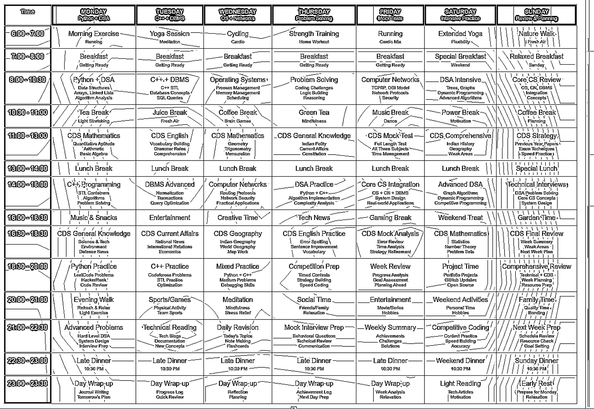

# 🗓️ TimeTable Scheduler

A Python-based application that intelligently extracts, processes, and schedules class or event timetables from images using OCR (Optical Character Recognition). Ideal for students or professionals looking to automate timetable creation and reminders.

---

## 📸 Screenshots

| Extracted Table | Raw OCR Input | Output Timetable |
|-----------------|----------------|------------------|
|  |  |   |

> 📝 **Note:** OCR accuracy may vary based on image quality and layout. Improvements are ongoing!

---

## 🚀 Features

- 📷 Convert timetable images to structured data using OCR
- 💾 **Save and load** processed timetables for future use
- 🔁 Schedule reminders for classes or events
- 🔊 Text-to-speech alerts via `pyttsx3`
- 🧠 Python-based logic for parsing and organizing data
- 🗂 Export processed timetable images for sharing or storage

---

## 🧰 Built With

- [OpenCV](https://pypi.org/project/opencv-python/)
- [NumPy](https://pypi.org/project/numpy/)
- [PaddleOCR](https://github.com/PaddlePaddle/PaddleOCR)
- [PaddlePaddle](https://pypi.org/project/paddlepaddle/)
- [Plyer](https://pypi.org/project/plyer/)
- [pyttsx3](https://pypi.org/project/pyttsx3/)
- [Schedule](https://pypi.org/project/schedule/)
- [Pillow](https://pypi.org/project/Pillow/)
- [Pandas](https://pypi.org/project/pandas/)
- Tesseract OCR (installed via system)

---

## 🔧 Installation

### 1. Clone this repository

```bash
git clone https://github.com/arthavgonda/TimeTableScheduler.git
cd TimeTableScheduler
2. Install Python dependencies
bash
Copy
Edit
pip install opencv-python numpy plyer pyttsx3 schedule pandas pillow paddlepaddle paddleocr
3. Install Tesseract OCR (for Ubuntu)
bash
Copy
Edit
sudo apt-get install tesseract-ocr
Optionally, use a GUI tool like gimagereader or test with tesseract image.png stdout to validate installation.

💾 Save and Load Timetables
📥 Save: After processing a timetable, save it to a local file (e.g., JSON or CSV).

📤 Load: Reuse previously saved timetables without needing to reprocess images.

This feature helps avoid repeating OCR on the same data and allows persistent access to timetables.

🧪 Known Issues & Improvements
✖️ OCR struggles with complex fonts or skewed images

⌛ Time parsing might fail for very irregular formats

💡 Working on improving OCR layout understanding with PaddleOCR
